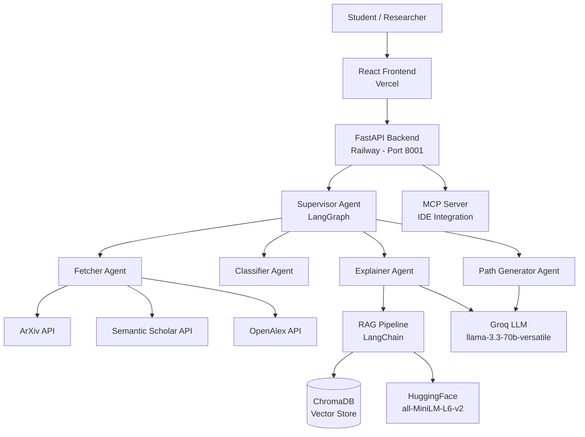
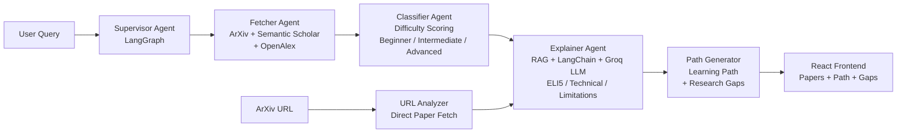
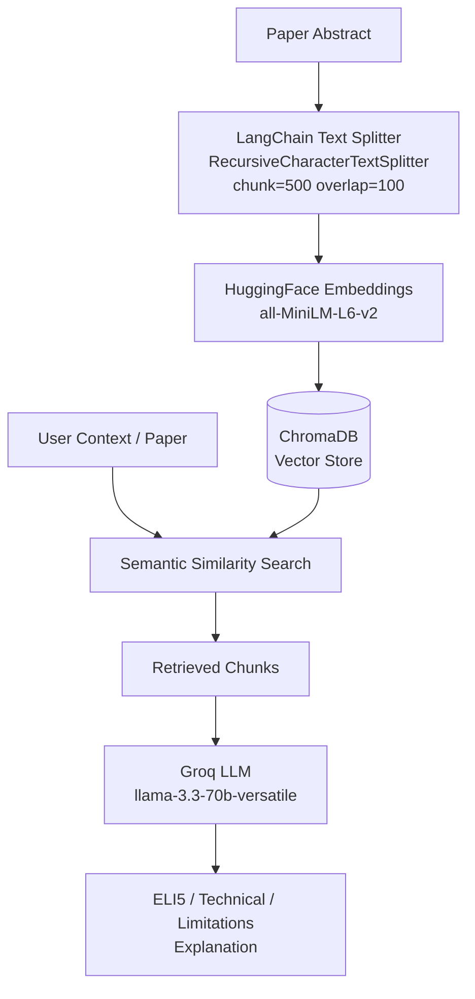

# 🎓 PaperPilotAI

### Multi-Agent Research Paper Discovery & Understanding Platform

A production-ready AI-powered research assistant that helps students, researchers, and academics find, understand, and master any research topic through intelligent multi-agent orchestration, RAG pipelines, and adaptive explanations.

[](https://paper-pilot-ai-sigma.vercel.app)
[](https://github.com/prishabhatia46/PaperPilotAI)
[](https://fastapi.tiangolo.com)
[](https://reactjs.org)
[](https://langchain-ai.github.io/langgraph)
[](LICENSE)

---

## 🎥 Product Walkthrough

[](https://drive.google.com/file/d/1z4Cl5T10Y4taQrNmDTErgvc26ACFFjZ9/view?usp=sharing)

*Click to watch a full walkthrough of the application.*

---

## ✨ Introduction

PaperPilotAI is a **production-grade multi-agent research assistant** built for students, researchers, and academics who want to go beyond keyword search and actually understand the papers they find.

Rather than building another basic paper search tool, PaperPilotAI orchestrates multiple specialized AI agents that work in sequence — fetching papers across ArXiv, Semantic Scholar, and OpenAlex, classifying their difficulty, generating layered explanations, building personalized learning paths, and identifying research gaps — all in a single search.

Built with a modern async FastAPI backend, LangGraph multi-agent orchestration, ChromaDB vector store, and a React frontend with voice search and dark/light themes.

---

## 💡 Why PaperPilotAI?

Research paper discovery is broken for most students.

Search engines return papers. But understanding them — knowing which to read first, what the limitations are, how they connect — requires hours of manual work.

PaperPilotAI was built to solve this gap. Instead of just returning links, it reads the papers for you, explains them at your level, ranks them by difficulty, and tells you exactly what order to study them in.

The result is a tool that compresses hours of literature review into minutes — and makes cutting-edge research accessible to anyone, not just domain experts.

---

## 🚀 What Makes PaperPilotAI Different?

### 🤖 Multi-Agent Orchestration
Not a chatbot — a pipeline of specialized agents. A Supervisor Agent coordinates Fetcher, Classifier, Explainer, and Learning Path agents running in sequence via LangGraph. Each agent has a single job and does it well.

### 🧠 Adaptive Explanations
Three audience levels — Beginner, Student, Expert — powered by Groq LLM. The same paper explained differently based on who's asking.

### 🔍 RAG-Powered Understanding
Paper abstracts are chunked using LangChain's `RecursiveCharacterTextSplitter`, embedded with HuggingFace `all-MiniLM-L6-v2`, and stored in ChromaDB. Explanations are grounded in retrieved context, not hallucinated.

### 📊 Difficulty Classification
A custom rule-based classifier scores each paper as Beginner / Intermediate / Advanced based on citation count, publication year, and abstract vocabulary — giving users an instant signal before they commit to reading.

### 🗺️ Research Gap Finder
After analyzing fetched papers, the LLM identifies unexplored areas in the topic — a feature almost no research tool offers, and genuinely useful for project ideation and thesis topics.

### 🔌 MCP Server
A custom Model Context Protocol server exposes PaperPilotAI tools so any AI agent — Claude Desktop, VS Code Copilot — can use paper search and learning path generation directly from the IDE.

---

## 🌟 Core Features

| 🔍 Discovery | 🧠 Understanding |
|---|---|
| Multi-source paper search | ELI5 / Student / Expert explanations |
| ArXiv + Semantic Scholar + OpenAlex | Technical summary & limitations |
| ArXiv URL paper analysis | Paper-specific AI chat |
| Voice search | Read-aloud via Web Speech API |
| Load more papers | Difficulty badge (Beginner / Intermediate / Advanced) |

| 📚 Learning | ⚡ Power Features |
|---|---|
| Personalized learning path | Paper comparison (side-by-side AI analysis) |
| Step-by-step reading order | Related paper suggestions |
| Research gap identification | PDF / print export |
| Reading progress tracker | MCP server for IDE integration |
| Mark as read | Dark / Light theme |

---

## 🏗 System Architecture



---

## 🔄 Agent Pipeline Flow



---

## 🧠 RAG Pipeline



---

## ⚡ At a Glance

| | |
|---|---|
| **Frontend** | React 18 + Axios + Web Speech API |
| **Backend** | FastAPI + Uvicorn (async) |
| **Agent Orchestration** | LangGraph multi-agent supervisor pattern |
| **LLM** | Groq (llama-3.3-70b-versatile) |
| **Vector Store** | ChromaDB |
| **Embeddings** | HuggingFace all-MiniLM-L6-v2 |
| **Text Splitting** | LangChain RecursiveCharacterTextSplitter |
| **Paper Sources** | ArXiv + Semantic Scholar + OpenAlex |
| **Deployment** | Vercel (frontend) + Railway (backend) |

---

## ⚙ Technology Stack

| Frontend | Backend | AI / ML | Infrastructure |
|---|---|---|---|
| React 18 | FastAPI | LangGraph | Vercel |
| Axios | Python 3.12 | Groq LLM | Railway |
| Web Speech API | Uvicorn | HuggingFace Embeddings | ChromaDB |
| CSS3 | Pydantic | LangChain | GitHub |
| React Speech Recognition | LangChain | all-MiniLM-L6-v2 | MCP Protocol |

---

## 📂 Project Structure

```
PaperPilotAI/
│
├── backend/
│   ├── agents/
│   │   ├── supervisor.py              # LangGraph pipeline orchestrator
│   │   ├── paper_fetcher_agent.py     # Multi-source paper retrieval
│   │   ├── classifier_agent.py        # Difficulty classification
│   │   ├── explainer_agent.py         # RAG-powered explanations
│   │   └── learning_path_agent.py     # Learning path + gap generation
│   │
│   ├── rag/
│   │   └── paper_rag.py               # LangChain + ChromaDB + HuggingFace RAG
│   │
│   ├── ml/
│   │   └── classifier.py              # Difficulty scoring logic
│   │
│   ├── tools/
│   │   └── arxiv_tool.py              # ArXiv + Semantic Scholar + OpenAlex
│   │
│   └── api.py                         # FastAPI routes
│
├── frontend/
│   └── paperpilot-ui/
│       ├── src/
│       │   ├── App.js                 # Main React component
│       │   └── App.css                # Dark / light theme styles
│       └── public/
│
├── mcp_server.py                      # MCP server for IDE integration
├── mcp_config.json                    # MCP configuration
├── .env                               # Environment variables
└── README.md
```

---

## 🚀 Getting Started

### Prerequisites

- Python 3.12+
- Node.js 18+ (for React frontend)
- Git

---

### 1️⃣ Clone the Repository

```bash
git clone https://github.com/prishabhatia46/PaperPilotAI.git
cd PaperPilotAI
```

---

### 2️⃣ Backend Setup

```bash
python -m venv venv

# Windows
venv\Scripts\activate

# macOS / Linux
source venv/bin/activate

pip install -r requirements.txt
```

Create `.env` file:

```env
GROQ_API_KEY=your_groq_api_key
GOOGLE_API_KEY=your_google_api_key
SEMANTIC_SCHOLAR_API_KEY=your_semantic_scholar_key
```

Start the backend:

```bash
uvicorn backend.api:app --reload --port 8001
```

API available at `http://localhost:8001`

---

### 3️⃣ Frontend Setup

```bash
cd frontend/paperpilot-ui
npm install
npm start
```

Frontend available at `http://localhost:3000`

---

## 🔐 Environment Variables

| Variable | Description |
|---|---|
| `GROQ_API_KEY` | Groq LLM API key — free at [console.groq.com](https://console.groq.com) |
| `GOOGLE_API_KEY` | Google Gemini API key (optional fallback) |
| `SEMANTIC_SCHOLAR_API_KEY` | Free at [semanticscholar.org](https://www.semanticscholar.org/product/api) |

---

## 📡 API Overview

| Method | Endpoint | Description |
|---|---|---|
| POST | `/search` | Multi-agent paper search pipeline |
| POST | `/analyze-url` | Analyze paper from ArXiv URL |
| POST | `/chat` | Ask AI about a specific paper |
| POST | `/compare` | Compare two papers side-by-side |
| POST | `/related` | Find related papers |
| POST | `/explain` | Adaptive explanation (Beginner / Student / Expert) |

---

## 📁 Application Modules

| Module | Responsibility |
|---|---|
| Supervisor Agent | LangGraph pipeline orchestration |
| Fetcher Agent | Multi-source paper retrieval with LLM relevance scoring |
| Classifier Agent | Difficulty classification (Beginner / Intermediate / Advanced) |
| Explainer Agent | RAG-powered explanations via LangChain + ChromaDB + Groq |
| Path Generator | Learning path + research gap identification |
| MCP Server | IDE integration via Model Context Protocol |

---

## 🛣 Roadmap

### ✅ Completed
- [x] Multi-agent LangGraph pipeline
- [x] RAG pipeline with LangChain + ChromaDB
- [x] Multi-source paper retrieval (ArXiv + Semantic Scholar + OpenAlex)
- [x] Difficulty classification
- [x] Adaptive explanations (3 audience levels)
- [x] Learning path generation
- [x] Research gap identification
- [x] Paper comparison
- [x] Voice search
- [x] ArXiv URL analyzer
- [x] MCP server for IDE integration
- [x] Production deployment (Vercel + Railway)

### 💡 Future Ideas
- [ ] PDF upload and analysis
- [ ] User accounts and saved libraries
- [ ] Citation graph visualization
- [ ] Email digest of weekly papers
- [ ] Slack / Notion integration
- [ ] Collaborative reading lists
- [ ] Docker setup

---

## 🤝 Contributing

Contributions are welcome.

1. Fork the repository
2. Create a feature branch
```bash
git checkout -b feature/new-feature
```
3. Commit changes
```bash
git commit -m "Add new feature"
```
4. Push and open a Pull Request
```bash
git push origin feature/new-feature
```

---

## 👩‍💻 Author

**Prisha Bhatia**

Computer Science Engineering Student | AI • Machine Learning • Full Stack Development

[](https://github.com/prishabhatia46)

---

## 📄 License

Distributed under the MIT License.

---

⭐ *If you found this project useful, consider giving it a star!*

**PaperPilotAI** — *Find, Understand, and Master Any Research Topic*
